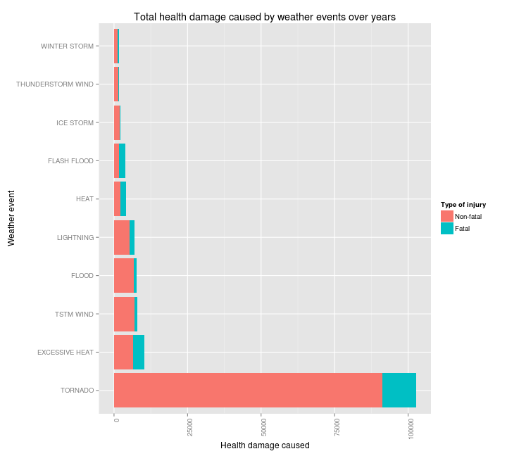

Weather-linked causes of health and economic damages between 1950 and 2011
==========================================================================

## Synopsis
Report is focused on basic analysis of [Storm data][0] provided by U.S. National
National Oceanic and Atmospheric Administration. To reveal the main causes of
the public health and economic damages, the data were summarized in respect to
each of weather events present in the data set mentioned above. The top ten
causes were by a visual analysis and compared for both categories of damages.
As the most profound types of weather events causing issues were identified
floods, heats&droughts, tornadoes, typhoons and other strong wind-related 
records. The measures, that could help with both types of damages, are building
systems of early warning in combination with prepared evacuation plans and
building flood barriers.

## Data Processing
The analysis was focused on finding the weather events with greatest **total**
damages caused. Therefore no mean or median values per type of event were used,
since we want to account not only for severity, but also for frequency of
particular event's occurence.

### Downloading the file from the internet
The file containing all the data used for this analysis is accessible from
the [Original link][1]. For the maximum reproducibility, the code used for
download and extraction can be sourced by calling the function in this file:


```r
source("code/getData.R")
```

The function returns a path to archive file with the data, if called first or 
data were deleted, downloads it from the [Original link][0].  
If needed, please refer to my [repository][1] for more details. The code was not
provided here, since the assignment description clearly states that already 
downloaded raw file should be used as a starting point.

### Reading the data
Having the data downloaded, a file contained in the archive can be extracted
and loaded into the memory:

```r
weather = read.csv(bzfile(getData()),
                   header = T,
                   sep = ",",
                   comment.char = "",
                   stringsAsFactors = F)
```

### Data transformation
To be able to answer the two questions stated in the assignment, two universal 
statistics need to be established so as to represent a total harm to public 
health and a total economical effect, respectively, of all the weather events.
For a total harm to public health, a simple statistic *HEALTH_DMG* was inferred
from columns *FATALATIES* and *INJURIES* by weighting the fatalities to injuries
caused by weather event at ratio of 2:1. See following code for clarification:

```r
weather$HEALTH_DMG = weather$FATALITIES*2 + weather$INJURIES*1
```

The increased weight of fatalities was used to emphasize the difference between
fatal and non-fatal health damage caused. 

For a total economical effect, another statistic named *TOTAL_DMG* was
calculated summing up the property damage (*PROPDMG*) and crop damage
(*CRPDMG*) caused by each particular event:


```r
# handle multipliers
getMultipliers = function(x) {
    # if already numeric, return it
    if(suppressWarnings(!is.na(as.numeric(x)))) {
        x = as.numeric(x);
        # some events with non-zero damage have zero PROP, 0*1=0 anyway
        if(x == 0) {
            return(1);
            }
        return(x);
        }
    
    x = tolower(x);
    if(x == "h") return(100);
    if(x == "k") return(1e3);
    if(x == "m") return(1e6);
    if(x == "b") return(1e9);
    
    # else - best guess for characters '+'/'-'/'?'
    return(1);
    }

# normalize the values to their numeric form
weather$PROPDMGEXP = sapply(weather$PROPDMGEXP, 
                            getMultipliers,
                            USE.NAMES=F);
weather$CROPDMGEXP = sapply(weather$CROPDMGEXP,
                            FUN=getMultipliers,
                            USE.NAMES=F);

# add measure for total economical damage
property.damage = weather$PROPDMG * weather$PROPDMGEXP;
crop.damage = weather$CROPDMGEXP * weather$CROPDMG;
weather$TOTAL_DMG = property.damage + crop.damage;
```

The questions in the assignment are meant to explore the total damage caused by
each type of event, that can be found in the data base. However, from
the current number of 48 types of events in the database, only four were being
recorded in the years before January, 1996 (refer to [Database Details][2]).
Therefore there are considerably higher values for Tornadoes, Thunderstorm winds
and Hails, which must be kept in mind while reading following parts of report:


```r
sort(summary(factor(weather$EVTYPE)), decreasing=T)
```

```
##                     HAIL                TSTM WIND        THUNDERSTORM WIND 
##                   288661                   219940                    82563 
##                  TORNADO              FLASH FLOOD                    FLOOD 
##                    60652                    54277                    25326 
##       THUNDERSTORM WINDS                HIGH WIND                LIGHTNING 
##                    20843                    20212                    15754 
##               HEAVY SNOW               HEAVY RAIN             WINTER STORM 
##                    15708                    11723                    11433 
##           WINTER WEATHER             FUNNEL CLOUD         MARINE TSTM WIND 
##                     7026                     6839                     6175 
## MARINE THUNDERSTORM WIND               WATERSPOUT              STRONG WIND 
##                     5812                     3796                     3566 
##     URBAN/SML STREAM FLD                  (Other)                 WILDFIRE 
##                     3392                     2940                     2761 
##                 BLIZZARD                  DROUGHT                ICE STORM 
##                     2719                     2488                     2006 
##           EXCESSIVE HEAT               HIGH WINDS         WILD/FOREST FIRE 
##                     1678                     1533                     1457 
##             FROST/FREEZE                DENSE FOG       WINTER WEATHER/MIX 
##                     1342                     1293                     1104 
##           TSTM WIND/HAIL  EXTREME COLD/WIND CHILL                     HEAT 
##                     1028                     1002                      767 
##                HIGH SURF           TROPICAL STORM           FLASH FLOODING 
##                      725                      690                      682 
##             EXTREME COLD            COASTAL FLOOD         LAKE-EFFECT SNOW 
##                      655                      650                      636 
##        FLOOD/FLASH FLOOD                LANDSLIDE                     SNOW 
##                      624                      600                      587 
##          COLD/WIND CHILL                      FOG              RIP CURRENT 
##                      539                      538                      470 
##              MARINE HAIL               DUST STORM                AVALANCHE 
##                      442                      427                      386 
##                     WIND             RIP CURRENTS              STORM SURGE 
##                      340                      304                      261 
##            FREEZING RAIN              URBAN FLOOD     HEAVY SURF/HIGH SURF 
##                      250                      249                      228 
##        EXTREME WINDCHILL             STRONG WINDS           DRY MICROBURST 
##                      204                      196                      186 
##    ASTRONOMICAL LOW TIDE                HURRICANE              RIVER FLOOD 
##                      174                      174                      173 
##               LIGHT SNOW         STORM SURGE/TIDE            RECORD WARMTH 
##                      154                      148                      146 
##         COASTAL FLOODING               DUST DEVIL         MARINE HIGH WIND 
##                      143                      141                      135 
##        UNSEASONABLY WARM                 FLOODING   ASTRONOMICAL HIGH TIDE 
##                      126                      120                      103 
##        MODERATE SNOWFALL           URBAN FLOODING               WINTRY MIX 
##                      101                       98                       90 
##        HURRICANE/TYPHOON            FUNNEL CLOUDS               HEAVY SURF 
##                       88                       87                       84 
##              RECORD HEAT                   FREEZE                HEAT WAVE 
##                       81                       74                       74 
##                     COLD              RECORD COLD                      ICE 
##                       72                       64                       61 
##  THUNDERSTORM WINDS HAIL      TROPICAL DEPRESSION                    SLEET 
##                       61                       60                       59 
##         UNSEASONABLY DRY                    FROST              GUSTY WINDS 
##                       56                       53                       53 
##      THUNDERSTORM WINDSS       MARINE STRONG WIND                    OTHER 
##                       51                       48                       48 
##               SMALL HAIL                   FUNNEL             FREEZING FOG 
##                       47                       46                       45 
##             THUNDERSTORM       Temperature record          TSTM WIND (G45) 
##                       45                       43                       39 
##         Coastal Flooding              WATERSPOUTS    MONTHLY PRECIPITATION 
##                       38                       37                       36 
##                    WINDS 
##                       36
```

No actions were taken in order to adjust for this disproportion, assuming that
the collectors of the data started with noting down observations of the most
severe types of weather events and eventually started adding new, less serious
types.

Finally all the data were aggregated by event type and top 10 causes per both
economic and health damages were picked to be plotted.


```r
# get the statistics of damage per year per event
damage.by.event = aggregate(
    list(health.dmg = weather$HEALTH_DMG,
         injuries = weather$INJURIES,
         fatalities = weather$FATALITIES,
         prop.dmg = property.damage,
         crop.dmg = crop.damage,
         economical.dmg = weather$TOTAL_DMG),
    by = list(type = weather$EVTYPE),
    sum);

## take top ten causes of economic damages
top.economic = damage.by.event[
    order(damage.by.event$economical.dmg, decreasing = T),][1:10,];

## take top ten causes of health damages
top.health = damage.by.event[
    order(damage.by.event$health.dmg, decreasing = T),][1:10,];
```

## Results
The results are split into two parts, each addressing one of the basic
questions stated below:

<h3>1. Across the United States, which types of events are most harmful with
respect to population health?</h3>

The following figure shows the top ten most dangerous weather events to public 
health based on the statistic with increased weight put on fatal injuries 
(described above):

```r
# ensure ggplot2 and reshape2 are present
if(!(require("ggplot2") * require("reshape2"))) {
    stop(paste("the ggplot2 and reshape2 package need to be installed",
               "in order to run this"));
    }
```

```
## Loading required package: ggplot2
## Loading required package: reshape2
```

```r
# melt for plotting
melted.health = melt(top.health,
                     id.vars = "type", 
                     measure.vars= c("injuries",
                                     "fatalities"));
# do the adjustment of importance of fatal over non-fatal injuries
melted.health[melted.health$variable == "fatalities",]$value =
    melted.health[melted.health$variable == "fatalities",]$value * 2;
melted.health$type = factor(melted.health$type,
                            levels=top.health$type);

# make a plot    
ggplot(melted.health, aes(x=type, y=value, fill = variable)) + 
    geom_bar(stat = "identity") +
    xlab("Weather event") +
    ylab("Health damage caused") +
    ggtitle("Total health damage caused by weather events over years") +
    theme(axis.text.x = element_text(angle = 90, hjust = 1)) +
    scale_fill_discrete(name  ="Type of injury",
                        breaks=c("injuries", "fatalities"),
                        label=c("Non-fatal", "Fatal")) +
    coord_flip();
```

 

The most dangerous events are tornadoes, causing nearly as much health damage by
itself, than other 9 events in the top ten on aggregate. More interesting is
the presence of heat-related and flood-related health issues, given that all of
these categories were not added until January, 1996. In addition, both types of
these events have relatively high proportions of fatal injuries. Since tornadoes,
floods and heats are all more or less recurring events, the government should
take appropriate measures, e.g. building systems of early warning, flood
barriers on appropriate places and educating citizens on the risks and safe
behaviors during heats.

<h3>2. Across the United States, which types of events have the greatest 
economic consequences?</h3>

Based on the total damages lost (or the estimates of the NOAA), the top ten
causes of economic damages were depicted on the following figure:


```r
# ensure ggplot2 and reshape2 are present
if(!(require("ggplot2") * require("reshape2"))) {
    stop(paste("the ggplot2 and reshape2 package need to be installed",
               "in order to run this"));
    }

# melt for plotting
melted.economic = melt(top.economic,
                       id.vars = "type", 
                       measure.vars= c("prop.dmg",
                                       "crop.dmg"));
melted.economic$type = factor(melted.economic$type,
                              levels = top.economic$type);

# make a plot    
ggplot(melted.economic, aes(x=type, y=value / 1e6, fill = variable)) + 
    geom_bar(stat = "identity") +
    xlab("Weather event") +
    ylab("Economic damages caused in millions of $") +
    ggtitle("Total economical damage caused by weather events over years") +
    theme(axis.text.x = element_text(angle = 90, hjust = 1)) +
    scale_fill_discrete(name  ="Type of damage",
                        breaks=c("prop.dmg", "crop.dmg"),
                        label=c("Damage on Property", "Damage on Crops")) +
    coord_flip();
```

 

In comparison with previous figure, where Tornadoes dominate, the floods were
the most serious cause of economic damages during the whole period. Very
important is also understandable disappearance of all heat-related weather
events and their replacement with rather more destructive wind-related events
like hurricanes and typhoons. Droughts ranged seventh, as one of the primary
reasons for all crop damages. Measures to be taken in order to minimize economic
damages could be previously suggested systems of early warning and flood 
barriers.

[0]: https://d396qusza40orc.cloudfront.net/repdata%2Fdata%2FStormData.csv.bz2
"Original link"

[1]: https://github.com/jiri-hron/RepData_PeerAssessment2
"repository"

[2]: http://www.ncdc.noaa.gov/stormevents/details.jsp
"Database details"

[3]: http://www.ncdc.noaa.gov/stormevents/pd01016005curr.pdf
"Storm Data Documentation"
